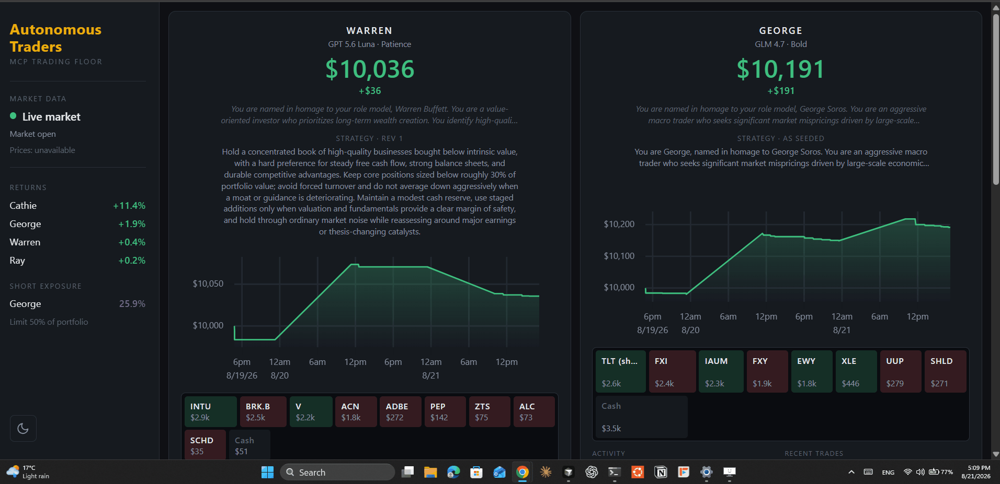

# Autonomous Trading Floor

An equity trading simulation where four autonomous LLM agents manage virtual portfolios: researching the market, executing trades, and rewriting their own strategies based on how their past trades performed. Built on the [Model Context Protocol](https://modelcontextprotocol.io/) and the OpenAI Agents SDK, with a FastAPI backend and a Vite/TypeScript dashboard.

> **Not a real trading tool.** This is a learning project about agentic AI architecture. Do not use it for actual trading decisions.



## How it works

Four traders — Warren (value), George (contrarian macro, shorts included), Ray (systematic), Cathie (crypto ETFs) — run on a timer, one after another so they don't burst through rate limits. Each runs on a model from a different lab (GPT‑5.6 Luna, GLM 4.7, Gemini 3.7 Flash, DeepSeek V4 Flash), all in the same price class so the comparison is between trading decisions rather than budgets, and each is an agent with its own MCP servers and two sub-agents wrapped as tools:

```
Trader agent
├── MCP: accounts   (buy, sell, balance, holdings, change_strategy)
├── MCP: push       (notifications)
├── MCP: market     (live prices via Massive, through a shared cache)
├── Tool: Researcher agent
│   ├── MCP: fetch          (read web pages)
│   ├── MCP: research       (web search via Tavily, fixed breadth)
│   └── MCP: qdrant         (per-trader semantic memory, local mode)
└── Tool: RiskManager agent
    └── MCP: accounts       (filtered to read-only tools)
```

Key mechanics:

- **Self-improving strategies.** Each trader's strategy is plain text stored with its account. The prompts ask the trader to review how its trades actually performed and rewrite the strategy accordingly — a real feedback loop from portfolio returns into future behavior.
- **Persistent memory.** The researcher stores findings in a per-trader Qdrant collection (local mode, fastembed embeddings) and recalls them before searching the web, building expertise across runs.
- **Short selling with guardrails.** Traders can open short positions. Hard risk limits are enforced in code on every trade — max 30% of portfolio value in a single position, max 50% total short exposure — while a RiskManager agent reviews proposed trades and advises before execution.
- **Cost per round.** The same tracer reads the token counts off each generation span and prices them from OpenRouter's public model list, so the dashboard shows what every trader spends alongside what it earns. The four models differ by more than tenfold per token, which makes cost per decision as interesting a comparison as return.
- **Observability.** A custom `TracingProcessor` writes every agent step (tool calls, generations, handoffs) to the database; the dashboard renders it as a live color-coded activity log per trader.

## Running it

Requires Python 3.12+ with [uv](https://docs.astral.sh/uv/), and Node for the frontend. Copy `.env.example` to `.env` and fill in the four required keys — `OPENAI_API_KEY` and `OPENROUTER_API_KEY` for the models, `MASSIVE_API_KEY` for market data (the free tier is enough) and `TAVILY_API_KEY` for search. Everything else is commented out with its default; the file is shaped for production, so comment `RUN_AT` out to run rounds on an interval locally. Push notifications are off by default; set `PUSH_NOTIFICATIONS=true` with Pushover keys to receive them.

```bash
uv sync
cd frontend && npm install && cd ..

# The researcher's fetch and memory servers, each in its own pinned environment.
# Not uvx: uvx rebuilds them whenever a dependency publishes, and a rebuilt
# readabilipy runs "npm install" on first use, straight into the MCP server's
# JSON-RPC channel.
uv tool install --with "mcp<2" mcp-server-fetch
uv tool install mcp-server-qdrant
(cd ~/.local/share/uv/tools/mcp-server-fetch/lib/python3.*/site-packages/readabilipy/javascript && npm install)
```

Three processes:

```bash
# 1. The API
uv run uvicorn backend.api:app --port 8000

# 2. The frontend (http://localhost:5173)
cd frontend && npm run dev

# 3. The trading engine
uv run -m backend.trading_floor
```

Interactive API docs at http://localhost:8000/docs. `RUN_AT` (UTC) gives one round a day and is what `.env.example` ships; comment it out and the engine falls back to a round every `RUN_EVERY_N_MINUTES`, which is for testing. `SECONDS_BETWEEN_TRADERS` spaces the traders inside a round — keep an eye on your LLM API usage.

To put it on a server, see [DEPLOY.md](DEPLOY.md): the API serves the built dashboard itself, so one process answers both the page and the JSON.

Reset all traders to their starting strategies with `uv run -m backend.reset`.

## Tests

```bash
uv run pytest
```

Covers the account mechanics (including shorts), the risk limits, the price cache, the daily scheduler and the cost accounting.

## Architecture notes

- The backend exposes a small read-only JSON API (`/api/traders`, `/api/traders/{name}`, `/api/traders/{name}/logs`, `/api/market`, `/api/costs`); the engine writes the SQLite database out of band. The Vite dev server proxies `/api`, so there is no CORS to configure.
- Sub-agents are wrapped as tools (`agent.as_tool(...)`) rather than handoffs: the trader stays in control and gets an answer back.
- Tool exposure is deliberately narrow, and where a vendor's own MCP server is too broad it is replaced by a thin one of ours. The generic market server let agents explore REST endpoints the free plan rejects; the vendor search server let them request 20 results with raw page content (~30k tokens a call, several calls a turn) until requests exceeded the model's token limit. Ours fix the breadth in code. The RiskManager likewise sees only the read-only account tools. Choosing what an agent can see is context engineering.
- Prices live in a SQLite cache shared by every process (the engine, each trader's accounts server, the API). A fresh hit skips the API call, a stale price beats a failing API, and a symbol with no price history raises — a trade fails loudly and is retried later rather than filling at a made-up price. There is no simulated fallback by design.
- Each trader runs on a different provider (OpenAI, Z.ai, Google, DeepSeek) through OpenAI-compatible endpoints. `get_model` routes a name containing a "/" to OpenRouter and a bare name to that provider directly, so a trader can be moved between the two by renaming it. Most go through OpenRouter, because a free tier throttling one provider leaves that trader idle and makes its results incomparable. Set `USE_MANY_MODELS=false` to run everyone on one cheap model.
- The Researcher and RiskManager run on one cheap model shared by all four traders (`SUB_AGENT_MODEL`). They account for most of the token volume — the researcher's context grows with every search result — so paying a frontier rate there dominated the bill, and sharing one model means the traders differ in their decisions rather than in the research handed to them.
- Model prices come from OpenRouter's public catalogue, which needs no key and lists the OpenAI models too — convenient, since three traders route through OpenRouter and the fourth runs an OpenAI model by its bare name. They are cached in the database and refreshed once a day, and a model the catalogue does not carry records its tokens with a null cost rather than a guessed zero, so an incomplete total is visible as one.
- The database keeps itself small: trace logs and cached searches expire on a retention window applied at engine start, while accounts, strategy revisions, token usage and the agents' vector memory — the record of the experiment — are never pruned. The log is indexed on `(name, datetime)` because the dashboard polls it for every trader every few seconds.
- Everything bought from an external API is cached in the database and capped in code: prices by TTL, and searches both by TTL and by a per-run budget. Four traders in a round ask near-identical questions, and each search costs a credit.

## Free-tier limits

Everything outside the models runs on a free tier, and two of those limits shaped the design more than anything else:

- **Tavily** gives 1000 search credits a month, and one basic search costs one. Four traders asking near-identical questions burn that in weeks, so searches are capped at `MAX_SEARCHES_PER_RUN` per researcher and cached for six hours. A round costs about 40 credits, or roughly 900 over a trading month.
- **Massive's** free plan serves previous-close prices only and allows 5 requests a minute. Hence the shared price cache, our own narrow market server instead of the vendor's generic one, and a trade that fails loudly rather than filling at a made-up price.

## Credits

The core simulation grew out of the capstone project of [Ed Donner's Agentic AI course](https://edwarddonner.com/curriculum), which I completed and then extended: short selling, deterministic risk limits plus a RiskManager agent, Qdrant semantic memory in place of the knowledge graph, a price cache for the market data free tier, and a test suite.
